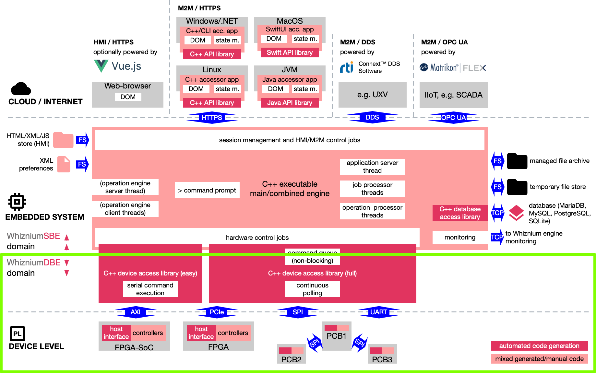

# WhizniumDBE

The Whiznium Device Builder's Edition, finally as Open Source Software project.

WhizniumDBE extends the concept of model-based source code generation to the world of FPGA's (and partially MCU's). On the optional Embedded Linux (host) level, it generates access libraries which can be used independently of WhizniumSBE projects.

## How it works

## Setup instructions, reference and cheat sheet

To prepare your system for use with Whiznium and to learn how to make your first steps, please visit this [separate Git repository](https://github.com/mpsitech/The-Whiznium-Documentation).

Also included is a full [WhizniumDBE model file reference](https://github.com/mpsitech/The-Whiznium-Documentation/blob/main/dbemdl.md).

To streamline the everyday WhizniumDBE-enhanced development workflow, the [WhizniumDBE .pdf cheat sheet](https://content.mpsitech.cloud/cheatsheet_wdbe.pdf), packed with useful information, might come in handy. A paper copy (size A3) can be ordered free of charge [here](https://content.mpsitech.cloud/cheatsheet.html).

## The Whiznium Developer Experience YouTube format

WhizniumDBE-related episodes so far include:

- [S1E1](https://youtu.be/SIz8meoCUl4): Why Whiznium? Let a laser scanner do the talking. 
- [S1E2](https://youtu.be/_J5aEs5J9tE): Whiznium modeling: Any aspect that's fit to code.
- [S1E3](https://youtu.be/Zf6G5EiLEak): Hunting down bugs in Whiznium application code.
- [S1E4](https://youtu.be/NqhiURBacEI): Boosting your development workflow: the Whiznium tooling.

## Source code

### Directory structure

Sub-folder|Content|
-|-|
_ini|database/tool initialization files|
_mdl|model files, text-based and diff-able between versions|
_rls|Makefiles and build/deploy scripts|
apiwdbe|auto-generated C++ API library (not in use for now)|
dbswdbe|auto-generated C++ database access library|
japiwdbe|auto-generated Java API library (used for WhizniumDBE Bootstrap and WhizniumDBE Iterator)|
webappwdbe|mixed auto-generated/manual HTML5/JS web-based user interface|
wdbecmbd|mixed auto-generated/manual C++ sources for all WhizniumDBE functionality|
wdbed|auto-generated C++ code specific for WhizniumDBE engine|
wdbeopd1|auto-generated C++ code specific for WhizniumDBE operation engine 1 / non-template functionality|
wdbeopd2|auto-generated C++ code specific for WhizniumDBE operation engine 2 / user-specific template functionality|

### Code highlights

Below is a non-exhaustive list of C++ source code files where interesting things happen:

File|Functionality|
-|-|
wdbecmbd/CrdWdbeVer/DlgWdbeVerNew.cpp|UI element (dialog) where a new project version can be created|
wdbecmbd/CrdWdbeRls/DlgWdbeRlsWrite.cpp|dialog which (re-)composes a project's source code tree, handles the required repository transactions, and which delegates code writing - fragmented into thousands of atomic operations - to the operation engines|
wdbecmbd/IexWdbe/JobWdbeIexBdd.cpp|mixed auto-generared/manual parsing (and data collecting/writing) of basic device description model files; relevant method enterSgeParse()|
wdbecmbd/IexWdbe/IexWdbeBdd.cpp|auto-generated combined XML/text reader/writer for basic device description model files|
wdbecmbd/WdbeModbsc/WdbeModbscTplcpy.cpp|instantiate template modules using parameters from basic device description|
wdbecmbd/WdbeModdet/WdbeModdetWiring.cpp|add ports and signals where necessary in order to establish connections to pins / higher-level ports and signals|
wdbecmbd/WdbeMtpWrfpga/WdbeMtpWrfpgaCrcspec_32_v1_0.cpp|write polynomial-specific VHDL code for CRC algorithm|
wdbecmbd/WdbeWrdev/WdbeWrdevCtr.cpp|write C++ code to conveniently invoke controller commands from the host system|
wdbecmbd/WdbeWrfpga/WdbeWrfpgaEhostif.cpp|write unit-specific VHDL code for easy model host interface|
wdbecmbd/WdbeWrfpga/WdbeWrfpgaMdlfine.cpp|fill in VHDL module skeleton with specifics such as conditional FSM transitions|
wdbecmbd/WdbeWrfpga/WdbeWrfpgaMdlraw.cpp|write VHDL module skeleton|
wdbecmbd/WdbeWrmcu/WdbeWrmcuMdlfine.cpp|write C code equivalent of VHDL state machine (part of experimental WhizniumDBE MCU suppport)|

## Template files

WhizniumDBE's automated source code generation relies on template files with inline placeholders and insertion points for multi-line code fragments. For each version of WhizniumDBE, the relevant template files can be found [online](https://content.mpsitech.cloud/WhizniumDBE/v1.0.2/files.tgz); they are part of the tool initialization routine.

### Some highlights

File|Functionality|
-|-|
Axihostif_Easy_v2_0.vhd|VHDL code to perform communications with the host system (commands and buffer transfers)|
Axirx_v2_0.vhd|32bit AXI slave receiver VHDL code corresponding to handshake established in module Zynq_ip_AXI_v2.0.vhd (see below)|
Spimaster_v1_0.vhd|SPI master interface VHDL code with adjustable bit rate, CPOL/CPHA and transfer length|
Uartrx_v1_1.vhd|UART receiver VHDL code with adjustable baud rate and transfer length|
UntXxxxYyyy_Easy.cpp|easy-model C++ code managing rx/tx protocol with device driver connecting to FPGA/MCU subsystem|
SysXxxxYyyyy.cpp|full-model C++ code managing non-blocking command execution and buffer transfers with FPGA subsystem|
Xxxx.vhd|VHDL constant definitions, "header file" for RTL module tree|
Xxxxx.vhd|base VHDL module file|
Zynq_ip_AXI_v2_0.vhd|AXI4-lite bus slave VHDL code based on Xilinx example, enhanced by protocol using distinct host write patterns to commence/end 32-bit transfers|

## Further Reading

### Upcoming book

- The Whiznium book (draft available [here](https://content.mpsitech.cloud/book.pdf)), offering an introduction to WhizniumDBE/DBE by means of a handy use case

### Use cases

- Whiznium StarterKit Device: Zynq (ARM and Xilinx FPGA) compatible VHDL code, with basic hardware control and 5 megapixel pipelined image processing. PolarFire SoC (RISC-V and Microchip FPGA) in the making. [Git repository](https://github.com/mpsitech/wskd-Whiznium-StarterKit-Device)

### Marketing material

Most of these publications pre-date Whiznium's Open Source era.

- WhizniumDBE technology overview [.pdf datasheet](https://content.mpsitech.cloud/whizniumdbe.pdf)
- [.pdf slides](https://content.mpsitech.cloud/wdbe_templates.pdf) outlining various levels of module templatification using WhizniumDBE

## Related Repositories

- The [WhizniumDBE core library](https://github.com/mpsitech/dbecore-WhizniumDBE-Core-Library)
- [WhizniumSBE](https://github.com/mpsitech/wznm-WhizniumSBE), Whiznium Service Builder's Edition, the big brother for developing feature-rich single board computer applications with C++ as main programming language

## Contact

The Whiznium project is developed and curated by Munich-based start-up [MPSI Technologies GmbH](https://www.mpsitech.com). Feel free to [contact us](mailto:contact@mpsitech.com) with any questions.
